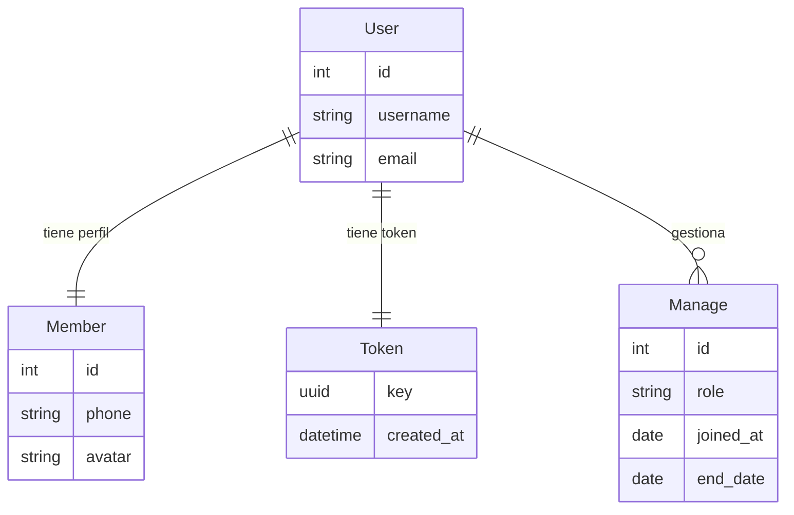
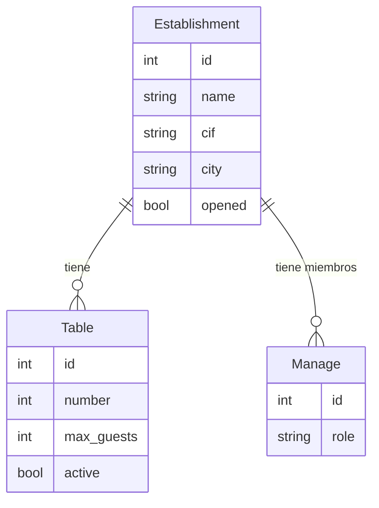
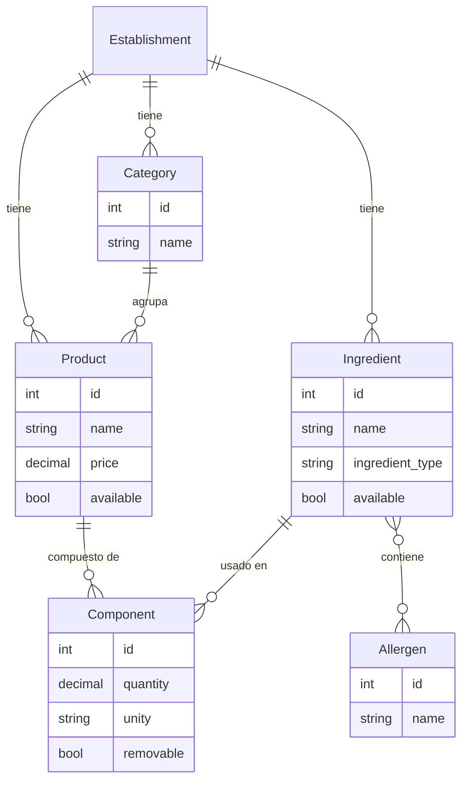
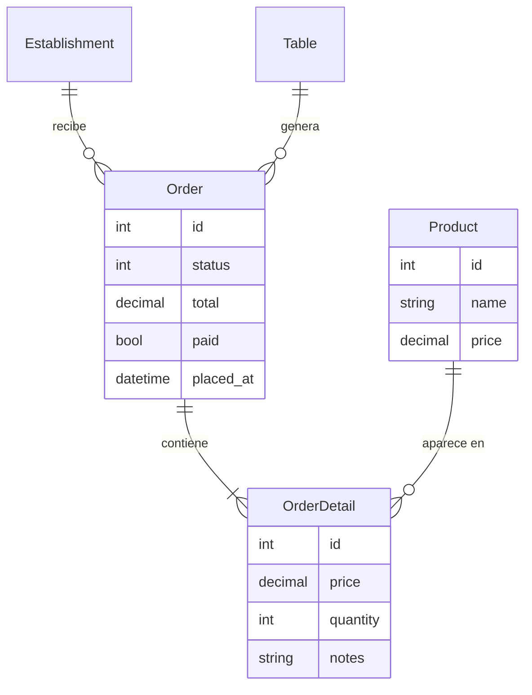

# Modelos

## Usuarios y autenticación

```mermaid
erDiagram
    User ||--|| Member : "tiene perfil"
    User ||--|| Token : "tiene token"
    User ||--o{ Manage : "gestiona"

    User {
        int id
        string username
        string email
    }
    Member {
        int id
        string phone
        string avatar
    }
    Token {
        uuid key
        datetime created_at
    }
    Manage {
        int id
        string role
        date joined_at
        date end_date
    }
```

## Establecimientos y mesas

```mermaid
erDiagram
    Establishment ||--o{ Table : "tiene"
    Establishment ||--o{ Manage : "tiene miembros"

    Establishment {
        int id
        string name
        string cif
        string city
        bool opened
    }
    Table {
        int id
        int number
        int max_guests
        bool active
    }
    Manage {
        int id
        string role
    }
```

## Productos e ingredientes

```mermaid
erDiagram
    Establishment ||--o{ Category : "tiene"
    Establishment ||--o{ Product : "tiene"
    Establishment ||--o{ Ingredient : "tiene"
    Category ||--o{ Product : "agrupa"
    Product ||--o{ Component : "compuesto de"
    Ingredient ||--o{ Component : "usado en"
    Ingredient }o--o{ Allergen : "contiene"

    Category { int id  string name }
    Product { int id  string name  decimal price  bool available }
    Ingredient { int id  string name  string ingredient_type  bool available }
    Component { int id  decimal quantity  string unity  bool removable }
    Allergen { int id  string name }
```

## Pedidos

```mermaid
erDiagram
    Establishment ||--o{ Order : "recibe"
    Table ||--o{ Order : "genera"
    Order ||--|{ OrderDetail : "contiene"
    Product ||--o{ OrderDetail : "aparece en"

    Order {
        int id
        int status
        decimal total
        bool paid
        datetime placed_at
    }
    OrderDetail {
        int id
        decimal price
        int quantity
        string notes
    }
    Product { int id  string name  decimal price }
```
